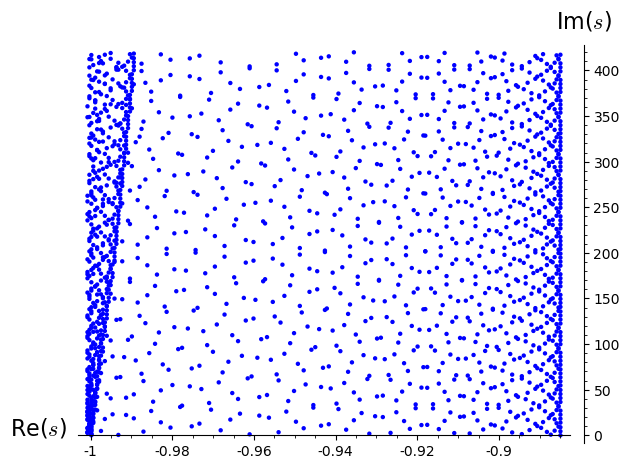

Welcome to PyZEAL's documentation!
==================================

.. |badge1| image:: https://img.shields.io/badge/Language-Python-blue.svg
   :target: https://www.python.org/

.. |badge2| image:: http://img.shields.io/badge/benchmarked%20by-asv-blue.svg?style=flat
   :target: https://github.com/Spectral-Analysis-UPB/PyZEAL

.. |badge3| image:: https://img.shields.io/github/v/release/Spectral-Analysis-UPB/PyZEAL
   :target: https://github.com/Spectral-Analysis-UPB/PyZEAL

.. |badge4| image:: https://readthedocs.org/projects/pyzeal/badge/?version=latest
   :target: https://pyzeal.readthedocs.io/en/latest/?badge=latest

.. |badge5| image:: https://github.com/Spectral-Analysis-UPB/PyZEAL/workflows/build/badge.svg
   :target: https://github.com/Spectral-Analysis-UPB/PyZEAL/actions

.. |badge6| image:: https://codecov.io/gh/Spectral-Analysis-UPB/PyZEAL/branch/main/graph/badge.svg
   :target: https://codecov.io/gh/Spectral-Analysis-UPB/PyZEAL

.. |badge7| image:: ./_static/docstr_coverage_badge.svg
   :target: https://pypi.org/project/docstr-coverage/

.. |badge8| image:: https://img.shields.io/badge/mypy-checked-blue
   :target: https://mypy.readthedocs.io/en/stable/

.. |badge9| image:: https://img.shields.io/badge/code%20style-black-000000.svg
   :target: https://github.com/psf/black

.. only:: html

    +----------+-------------+----------+----------+------------+
    | Project  | Build Status| Coverage | Checkers | Benchmarks |
    +==========+=============+==========+==========+============+
    | |badge1| | |badge5|    | |badge6| | |badge8| | |badge2|   |
    +----------+-------------+----------+----------+------------+
    | |badge3| | |badge4|    | |badge7| | |badge9| |            |
    +----------+-------------+----------+----------+------------+

--------------------------------

.. toctree::
   :maxdepth: 1
   :caption: Contents of PyZEAL's Documentation:
   :numbered:

   intro
   usage
   theory
   rootfinder
   algorithms
   estimators
   containers
   auto_diff

--------------------------------

The Origins of the **PyZEAL** Project
=====================================

This is the introduction to the **PyZEAL** numerics project dealing with the calculation
of zeros of holomorphic functions. With this project we plan on porting much of the functionality
of the original **ZEAL** (ZEros of AnaLytic functions [KVanBarelR+00]_) Fortran90 package
(and namesake for this project) to Python while both adding some convenience features as well
as leveraging more recent algorithms and technologies.

**PyZEAL** originated as part of the **PyZeta** project which provides facilities for the calculation
of dynamical zeta functions. These in turn allow one to determine dynamical invariants called
*Ruelle resonances* as their zeros (see the image below). Dynamical determinants being examples for rather
complicated holomorphic functions therefore set the context for the independent investigation and
implementation of root finding algorithms for this class of functions in the form of the present project.

The following is an example of resonances for a dynamical system called a *Schottky surface*. Plots such as this
(and significantly more complex numerical experiments) are straightforward to calculating by combining basic features
of **PyZEAL** and **PyZeta**:

If you want to get off the ground with using **PyZEAL** in your own project as fast as possible then :ref:`usage` is a
good place to get started. For a softer introduction and additional information on the philosophy and aims of this project
check out :ref:`intro`. For details on the theoretical background and a list of references relevant to **PyZEAL** visit
:ref:`theory`.

--------------------------------

.. [KVanBarelR+00] Kravanja, Van Barel, Ragos, Vrahatis, and Zafiropoulos. ZEAL: A mathematical software package for computing zeros of analytic functions. Computer Physics Communications, 124(2):212–232, 2000.
