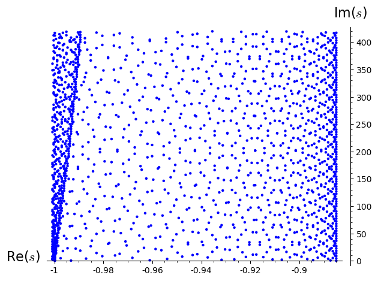

Welcome to PyZEAL's documentation!
==================================

.. toctree::
   :maxdepth: 2
   :caption: Table of Contents:
   :numbered:

   intro
   theoretical_background
   rootfinder
   automaticDifferentiation

--------------------------------

.. py:module:: MyIndexTest

The Origin of the PyZEAL Project
================================

This is the introduction to the PyZEAL numerics project dealing with the calculation
of zeros of holomorphic functions. In doing so we plan on porting much of the functionality
of the original **ZEAL** (ZEros of AnaLytic functions [KVanBarelR+00]_) Fortran90 package (and namesake for this project)
to Python while adding both convenience features as well as more recent algorithms.

PyZEAL originated as part of the **PyZeta** project which provides facilities for the calculation
of dynamical zeta functions. These in turn allow one to determine dynamical invariants called
*Ruelle resonances* as their zeros (see the image below). Dynamical determinants being examples for rather complicated
holomorphic functions therefore set the context for the independent investigation and implementation
of root finding algorithms for this class of functions in the form of the present project.

.. [KVanBarelR+00] Kravanja, Van Barel, Ragos, Vrahatis, and Zafiropoulos. ZEAL: A mathematical software package for computing zeros of analytic functions. Computer Physics Communications, 124(2):212–232, 2000.

For more information on the philosophy and aims of this project check out :ref:`intro`, for details
on the theoretical background see :ref:`theoretical_background`. A list of references relevant to **PyZEAL** can be
found below.

Bibliography
============

.. the following directive includes the *global* bibliography (even uncited
   elements, similar to LaTeX \nocite{}); current PDF docs have TWO bibos
.. bibliography::
   :all:

.. index:: index_test
